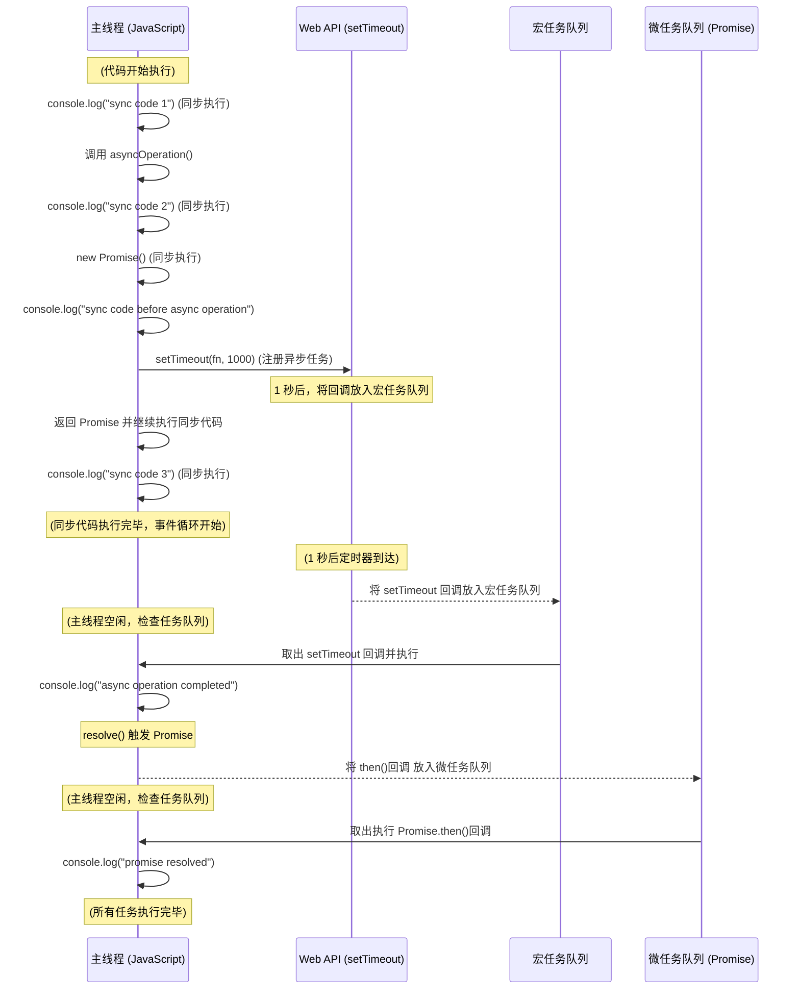

As we all know, JavaScript is a single-threaded language. This means that only one task can be executed at a time.
So, if you have a long-running task, it will block the execution of other tasks.  

Actually, JavaScript is a single-threaded language, but it has a non-blocking I/O model. This means that JavaScript can perform multiple tasks at the same time.
How does JavaScript achieve this? The answer is **Event Loop**.

## Event Loop

- [MDN Web Docs](https://developer.mozilla.org/en-US/docs/Web/JavaScript/Event_loop)

The Event Loop is a mechanism that allows JavaScript to perform non-blocking I/O operations. It is responsible for handling asynchronous operations in JavaScript.
On the other hand, the Event Loop is an approach to achieve asynchronous programming.

The Event Loop is a loop that continuously checks the call stack and the task queue. If the call stack is empty, it will take the first task from the task queue and push it onto the call stack.

Pseudo code:
```javascript
while (queue.waitForMessage()) {
  queue.processNextMessage();
}

```
More specifically, the Event Loop consists of the following components:
```js
function runJs() {
  let syncStack = [] // 同步执行栈
  let asyncMicroQueue = [] // 异步微任务队列
  let asyncMacroQueue = [] // 异步宏任务队列

  function runSyncStack() { // 主线程
    while (syncStack.length) syncStack.pop()() // 清空同步执行栈
    reRender() // 重新渲染
    runAsyncQueue() // 从任务队列取出异步任务执行
  }

  function runAsyncQueue() { // 任务队列
    while (asyncMicroQueue.length) asyncMicroQueue.shift()() // 先清空微任务队列

    while (asyncMacroQueue.length) {
       // 每执行一个异步宏，就要清空一次微任务队列（因为有可能异步宏会往微任务队列push异步微）
      asyncMacroQueue.shift()()
      while (asyncMicroQueue.length) asyncMicroQueue.shift()()
    }
    runSyncStack() // 回到js主线程
  }
  runSyncStack()
}

```

In concurrent programming, thread synchronization is often a concern. 
In JavaScript, how do multiple asynchronous operations synchronize data? The answer is **Promise**.


## Promise
 - [MDN Web Docs](https://developer.mozilla.org/en-US/docs/Web/JavaScript/Reference/Global_Objects/Promise)
 - [Comprehensive of promise](https://medium.com/@PavanCodeCraft/mastering-promises-in-javascript-41a0c9df7473)

Promise is a JavaScript object for asynchronous operations. It represents a value which may be available now, or in the future, or never.

Asynchronous operations are common in JavaScript, and often require a callback function. 

For example, the `setTimeout` function is used to run a function after a certain number of milliseconds. The callback function is called after the timer has expired.

```js
// async operation
setTimeout(() => {
  console.log("Hello, world!");
}, 1000);

```

The callback function is called when the async operation is completed. This is known as a callback-based approach.

However, callback-based code can be difficult to read and maintain.To Solve this problem, **Promises** were introduced in **ES6**.

With Promises, you can write asynchronous code that looks synchronous. This makes it easier to read and maintain.

```js
function asyncOperation() {
  console.log('sync code 2');
  // sync code
  return new Promise((resolve, reject) => {
    // return a promise for async operation
    console.log('sync code before async operation');
    // start async operation
    setTimeout(() => {
        console.log('async operation completed');
      // async operation is completed, resolve the promise
      resolve();
    }, 1000);
  });
}
console.log('sync code 1');
asyncOperation().then(() => {
  console.log('promise resolved');
});
console.log('sync code 3');
```

**Output:**
```sh
sync code 1
sync code 2
sync code before async operation
sync code 3
async operation completed
promise resolved
```
In the above code, the `asyncOperation` function returns a Promise object. The `then` method is used to handle the resolved value of the Promise.



Promises can be in one of three states:
- Pending: Initial state, neither fulfilled nor rejected.
- Fulfilled: The operation completed successfully.
- Rejected: The operation failed.

If the promise is resolved by async operation, the `then` method is called. 
If the promise is rejected, the `catch` method is called.

## Async/Await
Actually, the `async/await` syntax is built on top of Promises. It is a **syntactic sugar** for Promises.
```js
async function asyncOperation(){}
// equivalent to
function asyncOperation() {
  return Promise.resolve();
}
// equivalent to
function asyncOperation() {
  return new Promise((resolve, reject) => {
    resolve();
  });
}
```

The above three functions are equivalent. The `async` keyword is used to define an asynchronous function, and the following code is equivalent.
```js
async function main() {
  asyncOperation().then(() => {
    console.log('promise resolved');
  });
  // equivalent to
  await asyncOperation();
  console.log('promise resolved');
}
```

The `await` keyword is used to wait for the completion of an asynchronous operation. It can only be used inside an `async` function.

## Recap
- Event Loop is a mechanism that allows JavaScript to perform non-blocking I/O operations.
- Promise is a container for interactions between asynchronous operations.
- Async/Await is a syntactic sugar for Promises.
