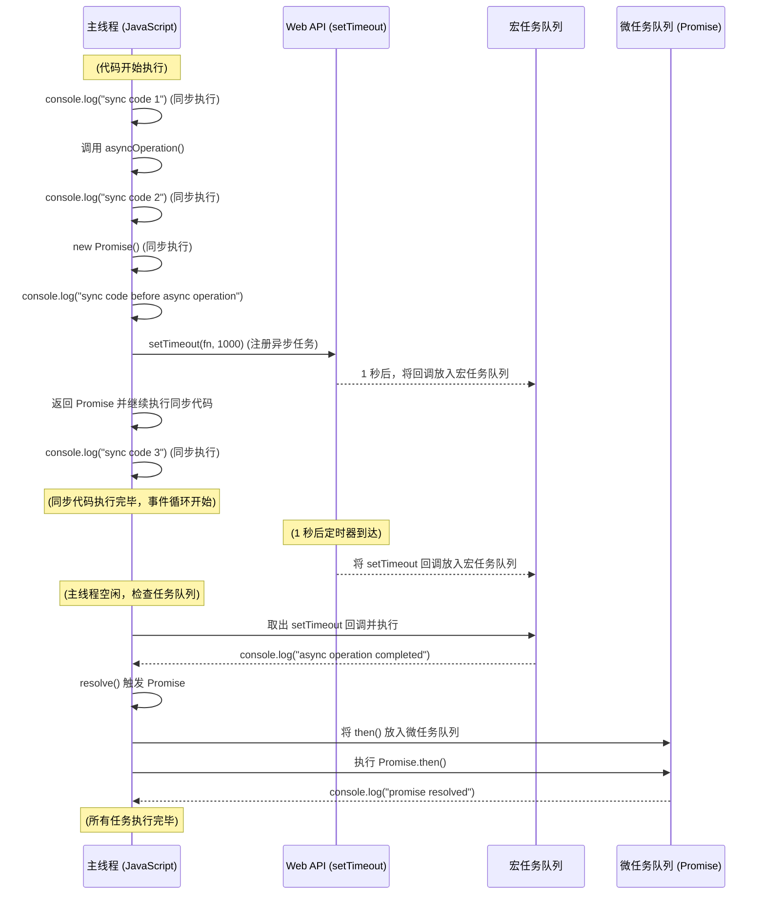

## References:
 - [MDN Web Docs](https://developer.mozilla.org/en-US/docs/Web/JavaScript/Reference/Global_Objects/Promise)
 - [Comprehensive of promise](https://medium.com/@PavanCodeCraft/mastering-promises-in-javascript-41a0c9df7473)

## Comprehensive
Promise is a JavaScript object for asynchronous operations. It represents a value which may be available now, or in the future, or never.

Asynchronous operations are common in JavaScript, and often require a callback function. 

For example, the `setTimeout` function is used to run a function after a certain number of milliseconds. The callback function is called after the timer has expired.

```js
// async operation
setTimeout(() => {
  console.log("Hello, world!");
}, 1000);

```

The callback function is called when the async operation is completed. This is known as a callback-based approach.

However, callback-based code can be difficult to read and maintain.To Solve this problem, **Promises** were introduced in **ES6**.

With Promises, you can write asynchronous code that looks synchronous. This makes it easier to read and maintain.

```js
function asyncOperation() {
  console.log('sync code 2');
  // sync code
  return new Promise((resolve, reject) => {
    // return a promise for async operation
    console.log('sync code before async operation');
    // start async operation
    setTimeout(() => {
        console.log('async operation completed');
      // async operation is completed, resolve the promise
      resolve();
    }, 1000);
  });
}
console.log('sync code 1');
asyncOperation().then(() => {
  console.log('promise resolved');
});
console.log('sync code 3');
```

Output:
```sh
sync code 1
sync code 2
sync code before async operation
sync code 3
async operation completed
promise resolved

```

In the above code, the `asyncOperation` function returns a Promise object. The `then` method is used to handle the resolved value of the Promise.




Promises can be in one of three states:
- Pending: Initial state, neither fulfilled nor rejected.
- Fulfilled: The operation completed successfully.
- Rejected: The operation failed.

## Recap
- Promises are used to handle asynchronous operations in JavaScript.
- Promise is a container for interactions between asynchronous operations.
