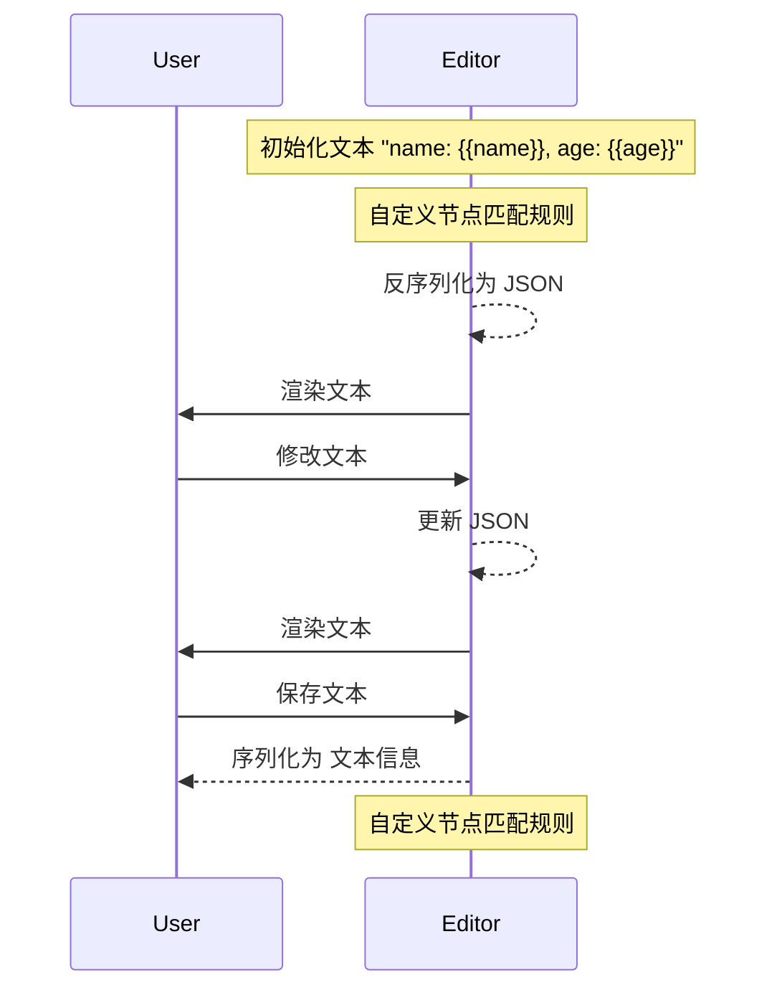

## Design

```mermaid
sequenceDiagram
    participant User
    participant Editor

    Note over Editor: 初始化文本 "name: {{name}}, age: {{age}}"
    Note over Editor: 自定义节点匹配规则
    Editor-->>Editor: 反序列化为 JSON
    Editor->>User: 渲染文本
    User->>Editor: 修改文本
    Editor-->>Editor: 更新 JSON
    Editor->>User: 渲染文本
    User->>Editor: 保存文本
    
    Editor-->>User: 序列化为 文本信息
    Note over Editor: 自定义节点匹配规则
```

