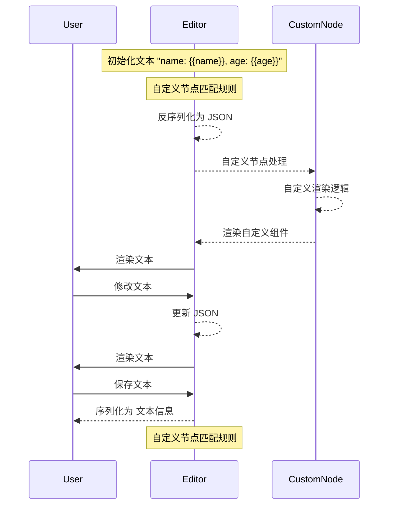

import { RichEditor } from '@site/src/components/rich-editor'

<RichEditor />
## Core Concept
- **Editor**: The main editor component
    - **Node**: A piece of content in the editor
    - **Mark**: A piece of text formatting
    - **Extension**: A piece of functionality
- **Schema**: The structure of the document
- **Commands**: Functions to manipulate the editor
- **Plugins**: Extend the editor with custom functionality
- **State**: The current state of the editor
## Design

## What
A RichEditor.
## How
Creating a custom node.
## Core Code
```tsx
const View = ({ node, updateAttributes }: NodeViewProps) => {
    const { type, value, options, placeholder } = node.attrs

    const handleInput = (e: React.FormEvent) => {
        const inputElement = e.target as HTMLInputElement;
        const newValue = inputElement.value || '';
        updateAttributes({ value: newValue })
    };

    // dynaimc with of input
    const count = caculteWidth(value ? value : placeholder);

    return (
        <NodeViewWrapper as="span">
            <NodeViewContent
                as={'input'}
                style={{ width: `${count}rem` }}
                contentEditable={false}
                onInput={handleInput}
                placeholder={placeholder}
                defaultValue={value}
            >
            </NodeViewContent>
        </NodeViewWrapper>
    )
}

const InlinePlaceholder = Node.create<InlinePlaceholderAttributes>({
    renderHTML({ HTMLAttributes, node }) {
        const attrs = mergeAttributes(
            this.options.HTMLAttributes || {},
            HTMLAttributes,
        );
        return ['span', attrs, 0]; // 0 or child of span
    },
    addNodeView() {
        return ReactNodeViewRenderer(View);
    },
})
```
